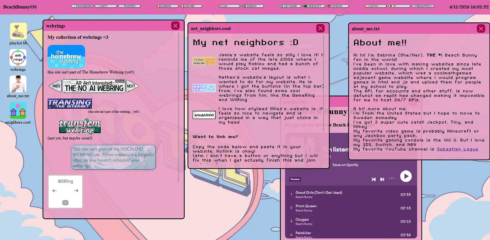

# Beach Bunny WebOS
My super cool and awesome personal website that looks like a computer

Live URL: https://beachbunnyos.netlify.app/

Features:
- playlist.bb app, you can see my beach bunny playlist
- webrings app, you can see the webrings im in/want to join
- about_me.txt app, info on me
- neighbors.cool app, cool net neighbors and why they are awesome. You can also link me when I get around to getting a domain and making a button
- the playlist.bb changes it's icon when opened
- clicking a window makes it become the top focused window

This project would be nothing without lots of CSS. The worst case is the webrings app where you need to scroll. I had to turn all windows into `display: grid`. It highkey took forever to find that out. Before I was having an issue where scaling a div to 100% of the parent height would just make it bigger for no reason apparently.

A good bit of inspiration came from my net neighbors, check them out